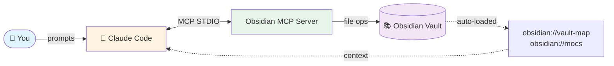
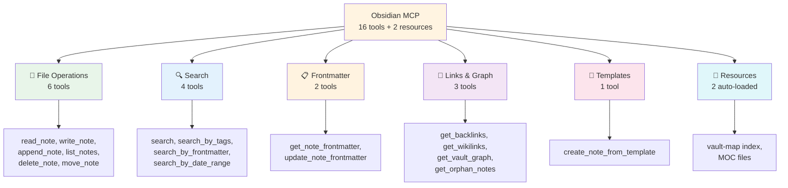
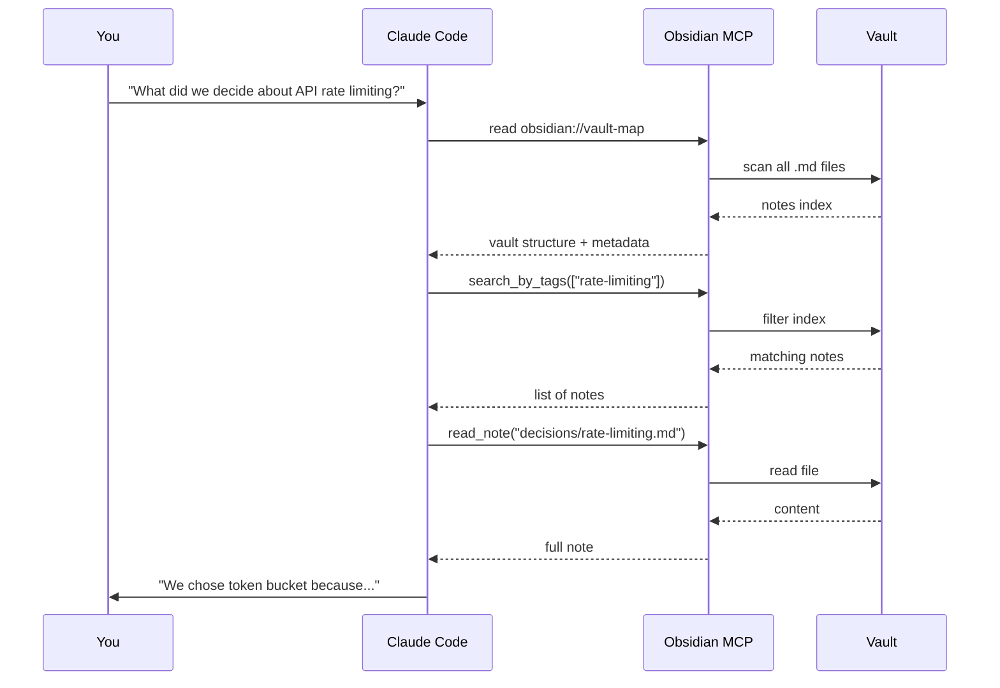

# Obsidian MCP Server

A [Model Context Protocol (MCP)](https://modelcontextprotocol.io/) server that gives Claude Code full read/write access to an Obsidian vault. Built with [FastMCP](https://github.com/jlowin/fastmcp).

## Architecture



## Tool Categories



## How Claude Uses Your Vault



## Features

**16 tools + 2 resources** for complete vault management:

| Group | Tool | Description |
|---|---|---|
| File ops | `read_note` | Read note by path |
| | `write_note` | Create/overwrite note |
| | `append_note` | Append to note |
| | `list_notes` | List .md files in folder |
| | `delete_note` | Delete a note |
| | `move_note` | Rename/move + auto-update wikilinks |
| Search | `search` | Full-text search |
| | `search_by_tags` | Find by #tags or frontmatter tags |
| | `search_by_frontmatter` | Find by any YAML property |
| | `search_by_date_range` | Filter by date (file or frontmatter) |
| Frontmatter | `get_note_frontmatter` | Parse YAML frontmatter |
| | `update_note_frontmatter` | Update properties without touching content |
| Links | `get_backlinks` | Find notes linking TO a note |
| | `get_wikilinks` | Extract outgoing wikilinks |
| | `get_vault_graph` | Full link graph (nodes + edges) |
| Templates | `create_note_from_template` | Create note from template with {{variables}} |

**Resources** (auto-loaded context):
- `obsidian://vault-map` -- index of all notes (path, title, tags, links, modified, summary)
- `obsidian://mocs` -- Map of Content hub notes

## Installation

### Docker (recommended)

Pre-built image from GitHub Container Registry:

```bash
docker pull ghcr.io/punparin/obsidian-mcp:latest
```

Or build locally:

```bash
git clone https://github.com/punparin/obsidian-mcp.git
cd obsidian-mcp
docker build -t obsidian-mcp .
```

### Local virtualenv

```bash
git clone https://github.com/punparin/obsidian-mcp.git
cd obsidian-mcp
python3 -m venv .venv
.venv/bin/pip install -e .
```

## Register with Claude Code

### Docker

```bash
claude mcp add \
  -s user \
  obsidian \
  -- docker run -i --rm -v /path/to/your/vault:/vault ghcr.io/punparin/obsidian-mcp:latest
```

### Local

```bash
claude mcp add \
  -e OBSIDIAN_VAULT_PATH=/path/to/your/vault \
  -s user \
  obsidian \
  -- /path/to/obsidian-mcp/.venv/bin/python -m obsidian_mcp
```

## Configuration

Set the vault path via environment variable:

```bash
export OBSIDIAN_VAULT_PATH=/path/to/your/obsidian/vault
```

## Frontmatter Convention

For best results, standardize your notes with YAML frontmatter:

```yaml
---
title: Meeting Notes
type: meeting-note    # note, project, meeting-note, reference, journal, moc
tags: [work, planning]
date: 2026-04-08
status: active        # draft, active, archived
---
```

The `type` field helps Claude understand what kind of note it's looking at without reading the full content.

## Templates

Place templates in a `templates/` folder in your vault. Use `{{variables}}` for expansion:

```markdown
---
title: {{title}}
date: {{date}}
---

## {{title}}

Created on {{date}} at {{time}}.
```

Built-in variables: `{{title}}`, `{{date}}`, `{{time}}`, `{{datetime}}`

## Development

```bash
# Install dev dependencies
.venv/bin/pip install -e ".[dev]"

# Run tests
.venv/bin/pytest tests/ -v

# Lint
.venv/bin/ruff check .
```

## Testing with MCP Inspector

```bash
npx @modelcontextprotocol/inspector .venv/bin/python -m obsidian_mcp
```
