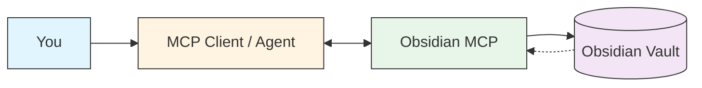
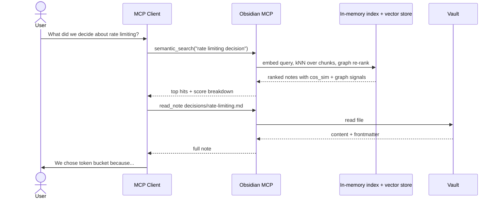

# Obsidian MCP Server

A [Model Context Protocol (MCP)](https://modelcontextprotocol.io/) server that gives any MCP-capable agent (Claude Code, Cursor, Cline, Continue, Goose, Windsurf, …) full read/write access to an Obsidian vault. Built with [FastMCP](https://github.com/jlowin/fastmcp).

## Quickstart

```bash
# 1. Pull the image
docker pull ghcr.io/punparin/obsidian-mcp:latest

# 2. Register with your MCP client (Claude Code shown — see "Register
#    with Your MCP Client" below for other clients). Skip semantic
#    search by setting OBSIDIAN_EMBEDDER=none if you don't have an
#    Ollama server handy.
claude mcp add -s user obsidian -- \
  docker run -i --rm \
    -v /path/to/your/vault:/vault \
    -e OBSIDIAN_EMBEDDER=none \
    ghcr.io/punparin/obsidian-mcp:latest
```

Then ask your agent something like *"list the notes I have about
project X"* or *"search my vault for the rate-limiting decision."*
The agent picks the right tool (`list_notes`, `search`,
`semantic_search`, etc.) on its own.

For the full semantic-search experience, point it at an Ollama
server: `-e OBSIDIAN_EMBEDDER=ollama -e OBSIDIAN_EMBEDDER_MODEL=qwen3-embedding:8b -e OLLAMA_URL=http://desktop.local:11434`.
Details under [Semantic Retrieval](#semantic-retrieval).

## Architecture



## Tool Categories

```mermaid
flowchart TD
    MCP[Obsidian MCP - 33 tools]

    MCP --> FileOps[File Operations - 6 tools]
    MCP --> Search[Search - 4 tools]
    MCP --> Meta[Frontmatter - 2 tools]
    MCP --> Links[Links and Graph - 4 tools]
    MCP --> Tpl[Templates - 1 tool]
    MCP --> Lint[Lint - 4 tools]
    MCP --> Schema[Schema - 3 tools]
    MCP --> Ingest[Ingest - 3 tools]
    MCP --> Sem[Semantic - 3 tools]
    MCP --> Sug[Suggest - 3 tools]
    MCP --> Res[Resources - 2 auto-loaded]

    FileOps --> F1[read_note, write_note, append_note, list_notes, delete_note, move_note]
    Search --> S1[search, search_by_tags, search_by_frontmatter, search_by_date_range]
    Meta --> FM1[get_note_frontmatter, update_note_frontmatter]
    Links --> L1[get_backlinks, get_wikilinks, get_vault_graph, get_orphan_notes]
    Tpl --> T1[create_note_from_template]
    Lint --> LI1[find_broken_wikilinks, find_stale_notes, find_duplicate_titles, lint_vault]
    Schema --> SC1[get_schema, validate_note_schema, validate_vault_schema]
    Ingest --> IN1[list_inbox, find_related_notes, archive_inbox_note]
    Sem --> SM1[semantic_search, rebuild_embeddings, embedding_stats]
    Sug --> SG1[suggest_links, apply_link_suggestion, dismiss_link_suggestion]
    Res --> R1[vault-map, mocs]
```



## How an Agent Uses Your Vault



The index and vector store live under `<vault>/.obsidian-mcp/` and stay
in sync with the vault via the filesystem watcher — the agent never
needs to re-scan to see your latest edits.

## Features

**33 tools + 2 resources** for complete vault management, self-maintaining knowledge wiki, and semantic retrieval:

| Group | Tool | Description |
|---|---|---|
| File ops | `read_note` | Read note by path |
| | `write_note` | Create/overwrite note |
| | `append_note` | Append to note |
| | `list_notes` | List .md files in folder |
| | `delete_note` | Delete a note |
| | `move_note` | Rename/move + auto-update wikilinks |
| Search | `search` | Full-text search |
| | `search_by_tags` | Find by #tags or frontmatter tags |
| | `search_by_frontmatter` | Find by any YAML property |
| | `search_by_date_range` | Filter by date (file or frontmatter) |
| Frontmatter | `get_note_frontmatter` | Parse YAML frontmatter |
| | `update_note_frontmatter` | Update properties without touching content |
| Links | `get_backlinks` | Find notes linking TO a note |
| | `get_wikilinks` | Extract outgoing wikilinks |
| | `get_vault_graph` | Full link graph (nodes + edges) |
| | `get_orphan_notes` | Find disconnected notes |
| Templates | `create_note_from_template` | Create note from template with {{variables}} |
| **Lint** | `find_broken_wikilinks` | Find unresolvable [[links]] |
| | `find_stale_notes` | Old notes still referenced from recent ones |
| | `find_duplicate_titles` | Notes with same filename in different folders |
| | `lint_vault` | Run all lint checks at once |
| **Schema** | `get_schema` | Read schema.yml from vault root |
| | `validate_note_schema` | Validate single note against schema |
| | `validate_vault_schema` | Validate entire vault |
| **Ingest** | `list_inbox` | List notes pending ingestion |
| | `find_related_notes` | Find existing notes related to raw content (semantic when enabled, lexical fallback) |
| | `archive_inbox_note` | Move processed note to archive/YYYY-MM/ |
| **Semantic** | `semantic_search` | Embedding + graph-aware re-rank over note chunks |
| | `rebuild_embeddings` | Full re-embed of the vault (idempotent) |
| | `embedding_stats` | Inspect the embedding index (counts, model, path) |
| **Suggest** | `suggest_links` | Find note pairs that look related but aren't wikilinked |
| | `apply_link_suggestion` | Append `See also: [[target]]` (idempotent) |
| | `dismiss_link_suggestion` | Hide a pair from future suggestions (persistent) |

**Resources** (auto-loaded context):
- `obsidian://vault-map` -- index of all notes (path, title, tags, links, modified, summary)
- `obsidian://mocs` -- Map of Content hub notes

## Installation

### Docker (recommended)

Pre-built image from GitHub Container Registry:

```bash
docker pull ghcr.io/punparin/obsidian-mcp:latest
```

Or build locally:

```bash
git clone https://github.com/punparin/obsidian-mcp.git
cd obsidian-mcp
docker build -t obsidian-mcp .
```

### Local virtualenv

```bash
git clone https://github.com/punparin/obsidian-mcp.git
cd obsidian-mcp
python3 -m venv .venv
# Pick an embedding setup — see "Embedding model selection" below.
.venv/bin/pip install -e ".[fastembed]"   # in-process model (~130MB download on first use)
# OR
.venv/bin/pip install -e .                # base only — semantic features require Ollama (see below)
```

> **Heads up:** `fastembed` is not in base deps. The Docker image and
> the bare `pip install -e .` ship without it; semantic features then
> expect a remote Ollama server. This keeps the Docker image slim and
> removes any chance of an unexpected model download at runtime.

## Register with Your MCP Client

The server speaks stdio MCP, so it works with any MCP-capable client.
Concrete examples below use Claude Code's `claude mcp add` CLI, but the
shape is the same for [Cursor](https://docs.cursor.com/), [Cline](https://cline.bot/),
[Continue](https://www.continue.dev/), [Goose](https://block.github.io/goose/),
[Windsurf](https://codeium.com/windsurf), or any other MCP host —
consult your client's docs for its registration syntax.

### Docker (Claude Code example)

The image defaults to `OBSIDIAN_EMBEDDER=ollama` and contains no embedding
model — point it at an Ollama server you already run (e.g. on a desktop)
or set `OBSIDIAN_EMBEDDER=none` to skip semantic features entirely.

```bash
claude mcp add \
  -s user \
  obsidian \
  -- docker run -i --rm \
       -v /path/to/your/vault:/vault \
       -e OBSIDIAN_EMBEDDER_MODEL=qwen3-embedding:8b \
       -e OLLAMA_URL=http://desktop.local:11434 \
       ghcr.io/punparin/obsidian-mcp:latest
```

### Local (Claude Code example)

```bash
claude mcp add \
  -e OBSIDIAN_VAULT_PATH=/path/to/your/vault \
  -s user \
  obsidian \
  -- /path/to/obsidian-mcp/.venv/bin/python -m obsidian_mcp
```

For other clients, plug the same `docker run …` or `python -m obsidian_mcp`
command into your client's MCP server config (typically a JSON entry
specifying the command, args, and env).

## Configuration

Set the vault path via environment variable:

```bash
export OBSIDIAN_VAULT_PATH=/path/to/your/obsidian/vault
```

## Agent Usage Guide

See [`docs/using-with-claude-code.md`](docs/using-with-claude-code.md)
for rules on tool choice (semantic vs exact), writing flow, ingest
flow, interpreting score signals, and a ready-to-paste block for your
agent's system prompt or per-project instruction file (`CLAUDE.md`,
`.cursor/rules`, `.continuerules`, AGENTS.md, etc.). The patterns
transfer to any MCP client; only the file Claude Code happens to
read is named `CLAUDE.md`.

## Semantic Retrieval

Local-first semantic search over your vault, using your hand-curated graph
(wikilinks, tags, frontmatter) to re-rank the raw embedding results.

**How it works:**
1. On server start, each note's body is split into markdown-aware chunks
   (H2/H3 sections, packed to ≤1600 chars with paragraph overlap).
2. Each chunk is embedded — either by a remote [Ollama](https://ollama.com)
   server (default in Docker) or by an in-process [`fastembed`](https://github.com/qdrant/fastembed)
   model (opt-in extra). See *Embedding model selection* below.
3. Vectors live in `<vault>/.obsidian-mcp/index.db` (SQLite + `sqlite-vec`).
4. On query: embed the query → top-K chunks via cosine distance →
   aggregate to notes → re-rank with graph signals.

**Re-rank formula** (weights all env-tunable):

```
final = 1.00 * cos_sim              # semantic similarity
      + 0.40 * wikilink_match       # 1 if candidate is [[linked]] from query
      + 0.30 * tag_jaccard          # |shared tags| / |union|
      + 0.15 * neighbor_bonus       # 1/hops if within 2 hops of a query-linked note
      + 0.10 * recency_decay        # exp(-age_days/180)
```

Your explicit wikilinks can beat a marginally higher semantic score — the
bias is deliberate. Tune via `OBSIDIAN_W_SEM`, `OBSIDIAN_W_LINK`,
`OBSIDIAN_W_TAG`, `OBSIDIAN_W_NEIGHBOR`, `OBSIDIAN_W_RECENCY`.

**Lifecycle:**
- Edits (from MCP or Obsidian) are picked up by the filesystem watcher and
  re-embedded in the background with a 200ms debounce.
- Body unchanged? `body_hash` short-circuits the embed.
- `find_related_notes` automatically uses the semantic pipeline when
  enabled, with the lexical scorer as a fallback.

**Disabling:** set `OBSIDIAN_EMBEDDER=none` to skip all of this; the three
new tools will no-op and `find_related_notes` falls back to lexical.

### Embedding model selection

Two backends are available; pick one with `OBSIDIAN_EMBEDDER`:

| `OBSIDIAN_EMBEDDER` | Where it runs | When to use |
|---|---|---|
| `ollama` (Docker default) | HTTP to a remote [Ollama](https://ollama.com) server | Recommended. Lets you pick any embedding model without bloating the MCP host. Required for the slim Docker image. |
| `fastembed` (factory default when unset) | In-process ONNX, downloads `BAAI/bge-small-en-v1.5` (~130MB) on first use | Single-host setups where you don't want a separate Ollama server. Requires `pip install ".[fastembed]"` — base install will fail to start with a hint pointing here. |
| `fake` | Deterministic stub | Tests only |
| `none` | — | Disable semantic features entirely |

**Env vars:**

```bash
OBSIDIAN_EMBEDDER=ollama
OBSIDIAN_EMBEDDER_MODEL=qwen3-embedding:8b   # or :4b, bge-m3, mxbai-embed-large, ...
OLLAMA_URL=http://desktop.local:11434        # default http://localhost:11434
```

**Recommended models** (descending quality, all via Ollama unless noted):

| Model | Dim | Notes |
|---|---|---|
| `qwen3-embedding:8b` | 4096 | **Recommended.** SOTA on MTEB, strong multilingual (Thai/Chinese/Japanese). ~16KB per vector — heaviest, but best quality |
| `qwen3-embedding:4b` | 2560 | Sweet spot: close to 8B quality at ~⅔ storage and noticeably faster |
| `bge-m3` | 1024 | Lightweight multilingual fallback, long context (8k) |
| `mxbai-embed-large` | 1024 | Strong English-only option; older but well-supported |
| `nomic-embed-text` | 768 | Balanced quality/speed; 8k context |
| `BAAI/bge-small-en-v1.5` | 384 | Default fastembed model — Pi-friendly, English only |

Rankings shift fast — cross-check the [MTEB leaderboard](https://huggingface.co/spaces/mteb/leaderboard) before committing to a model for a large vault. Larger dim = better recall but more disk + slower kNN.

**Switching is safe:** the vector store records the active model and
dim. On startup, if either has changed, the index is cleared and the
reconcile loop re-embeds every note in the background. Expect a few
minutes of degraded search quality after a switch on large vaults.

## Auto-Link Suggestions

Find pairs of notes that look related but aren't wikilinked yet — and
grow your graph without re-reading the whole vault.

**How it works:**

1. For each note, embed the body and pull the top-K nearest neighbors
   from the chunk vector store.
2. Skip self-pairs and pairs already wikilinked in either direction
   (treated as undirected) and pairs you've previously dismissed.
3. Score = `0.7 * cos_sim + 0.3 * tag_jaccard`. Above a threshold
   (default 0.55) it shows up as a suggestion.
4. Dedupe by canonical pair so A→B and B→A are one suggestion.

```python
# MCP tools
suggest_links(path="", limit=25, min_score=0.55)
apply_link_suggestion(source, target)   # idempotent — adds "See also: [[target]]"
dismiss_link_suggestion(source, target) # persistent across runs
```

The Vault Explorer has a **Link suggestions** tab that lists results
with score + shared tags + snippet, plus per-row Apply / Dismiss
buttons. Apply re-fetches the index naturally on the next scan, so
applied pairs disappear automatically once the vault is updated.

## Live Vault Sync

The server keeps its in-memory index in sync with the vault via a
filesystem watcher (backed by `watchdog`). Edits you make directly in
Obsidian — or any other tool — are reflected in the next MCP query
without restarting the server.

The watcher also backs **conflict detection on writes**: if a note
changed on disk between the agent's last `read_note` and its next
`write_note` on the same path, the write is refused with a
`NoteConflictError` so you don't clobber an edit made in Obsidian. Pass
`force=true` to override intentionally.

Directories like `.obsidian/`, `.git/`, `.trash/`, and non-markdown
files are ignored by the watcher.

## Frontmatter Convention

For best results, standardize your notes with YAML frontmatter:

```yaml
---
title: Meeting Notes
type: meeting-note    # note, project, meeting-note, reference, journal, moc
tags: [work, planning]
date: 2026-04-08
status: active        # draft, active, archived
---
```

The `type` field helps the agent understand what kind of note it's looking at without reading the full content.

## Templates

Place templates in a `templates/` folder in your vault. Use `{{variables}}` for expansion:

```markdown
---
title: {{title}}
date: {{date}}
---

## {{title}}

Created on {{date}} at {{time}}.
```

Built-in variables: `{{title}}`, `{{date}}`, `{{time}}`, `{{datetime}}`

## Self-Maintaining Wiki

Inspired by [Karpathy's LLM Wiki pattern](https://gist.github.com/karpathy/442a6bf555914893e9891c11519de94f). Three layers turn your vault into a knowledge base that compounds over time:

### 1. Lint — find rot before it spreads

Run `lint_vault` periodically. It catches:
- Broken wikilinks (notes you renamed without updating references)
- Stale notes (old content still linked from recent work — review or update)
- Duplicate titles (causes wikilink ambiguity)
- Orphan notes (disconnected knowledge)

### 2. Schema — structured note types

Create `schema.yml` at vault root:

```yaml
note_types:
  project:
    required: [title, status, area]
    optional: [tags, due_date]
    status_values: [active, paused, done, archived]
  decision:
    required: [title, date, status]
    optional: [project, participants, tags]
    status_values: [proposed, decided, superseded]
  meeting-note:
    required: [title, date]
    optional: [participants, project, tags]

folders:
  projects: project
  decisions: decision
  meetings: meeting-note
```

Then run `validate_vault_schema` to find notes missing required fields.

### 3. Ingest — raw content → wiki

Drop articles, rough notes, or research into vault `inbox/` folder. Workflow:

```
1. list_inbox                  → see what's pending
2. read each item              → understand the content
3. find_related_notes(content) → discover existing notes it relates to
4. update those notes          → integrate the new knowledge
5. archive_inbox_note          → move source to archive/YYYY-MM/
```

The agent does the synthesis. The MCP just handles bookkeeping.

## Development

```bash
# Install dev dependencies
.venv/bin/pip install -e ".[dev]"

# Install the pre-commit hook (one-time, gates `git commit` on lint)
.venv/bin/pre-commit install

# Run tests
.venv/bin/pytest tests/ -v

# Lint
.venv/bin/ruff check .

# Run all hooks across the whole repo (what CI runs)
.venv/bin/pre-commit run --all-files
```

## Testing with MCP Inspector

```bash
npx @modelcontextprotocol/inspector .venv/bin/python -m obsidian_mcp
```

## Vault Explorer

A browser UI bundled in the same package — for **debugging** retrieval
("why did this note rank where it did?"), **visualizing** the wikilink
graph alongside live query hits, and **demoing** the semantic + graph
stack to teammates. Query box, ranked results with per-signal score
breakdown bars, slider-tunable re-rank weights with presets, and a
Cytoscape graph view that highlights hits and neighbors.

### Local

```bash
.venv/bin/pip install -e ".[explorer]"
OBSIDIAN_VAULT_PATH=/path/to/vault .venv/bin/python -m obsidian_mcp.explorer
# open http://127.0.0.1:8765
```

### Docker

```bash
docker pull ghcr.io/punparin/obsidian-mcp-explorer:latest
docker run --rm -p 8765:8765 -v /path/to/your/vault:/vault \
  ghcr.io/punparin/obsidian-mcp-explorer:latest
# open http://127.0.0.1:8765
```

Or build locally:

```bash
docker build -f Dockerfile.explorer -t obsidian-mcp-explorer .
docker run --rm -p 8765:8765 -v /path/to/vault:/vault obsidian-mcp-explorer
```

The Explorer imports `Vault` directly — same SQLite index as the MCP
server, so changes made through any MCP client or in Obsidian show up
live. Tuning a weight slider re-issues the query against the current
index; no server restart needed.

#### Endpoints

- `GET /` — single-page UI
- `GET /api/health` — vault path, semantic state, embedding stats
- `POST /api/search` — body `{query, k, weights?}` → ranked results with
  `cos_sim`, per-signal `contributions`, and `signals` breakdown
- `GET /api/graph` — Cytoscape-friendly `{nodes, edges}` of the vault
  wikilink graph
- `GET /api/note?path=...` — full note content + frontmatter
- `GET /api/suggestions?min_score=&limit=&path=` — auto-link suggestions
  (note pairs that look related but aren't wikilinked)
- `POST /api/suggestions/apply` — body `{source, target}` → appends
  `See also: [[target]]` to the source (idempotent)
- `POST /api/suggestions/dismiss` — body `{source, target}` → hides the
  pair from future scans (persistent)

