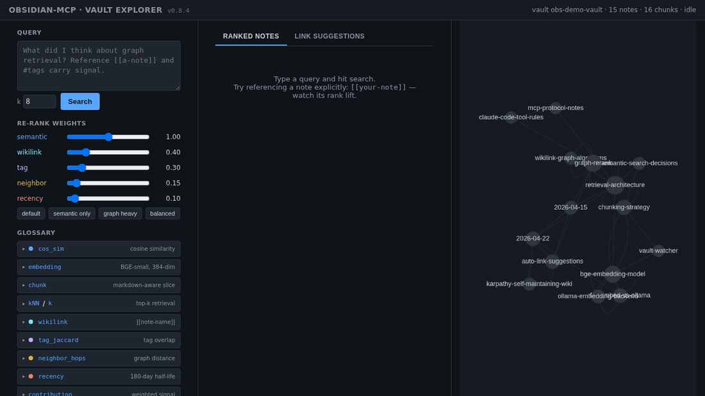

# Obsidian MCP Server

A [Model Context Protocol (MCP)](https://modelcontextprotocol.io/)
server that gives any MCP-capable agent (Claude Code, Cursor, Cline,
Continue, Goose, Windsurf, …) full read/write access to an Obsidian
vault. Built with [FastMCP](https://github.com/jlowin/fastmcp).


## Install via your agent (easiest)

Open your MCP-capable agent and paste:

> Read this and help me install it: <https://github.com/punparin/obsidian-mcp/blob/main/INSTALLATION.md>

The agent walks you through it — Docker vs Python, vault path,
semantic-search backend, scope — and asks before assuming anything.
See [`INSTALLATION.md`](./INSTALLATION.md) for the full guide.

## Manual quickstart

```bash
# 1. Pull the image
docker pull ghcr.io/punparin/obsidian-mcp:latest

# 2. Register with your MCP client (Claude Code shown). Skip semantic
#    search by setting OBSIDIAN_EMBEDDER=none if you don't have an
#    Ollama server handy.
claude mcp add -s user obsidian -- \
  docker run -i --rm \
    -v /path/to/your/vault:/vault \
    -e OBSIDIAN_EMBEDDER=none \
    ghcr.io/punparin/obsidian-mcp:latest
```

Then ask your agent something like *"list the notes I have about
project X"* or *"search my vault for the rate-limiting decision."*
The agent picks the right tool (`list_notes`, `search`,
`semantic_search`, etc.) on its own.

For the full semantic-search experience, point at an Ollama server:
`-e OBSIDIAN_EMBEDDER=ollama -e OBSIDIAN_EMBEDDER_MODEL=qwen3-embedding:8b -e OLLAMA_URL=http://desktop.local:11434`.
See [`docs/semantic.md`](./docs/semantic.md) for the embedder
selection table and recommended models.

## What it does

**33 tools + 2 auto-loaded resources** across file ops, search (text
+ semantic), frontmatter, wikilink graph, templates, lint, schema
validation, ingest workflow, and auto-link suggestions.

See [`docs/tools.md`](./docs/tools.md) for the full reference.

Want to debug retrieval, see the wikilink graph live, or surface
auto-link suggestions? Run the [Explorer](./docs/explorer.md) sidecar.



## Documentation

- [`docs/architecture.md`](./docs/architecture.md) — components, tool
  categories, agent → MCP → vault flow
- [`docs/tools.md`](./docs/tools.md) — full tool table + resources
- [`docs/configuration.md`](./docs/configuration.md) — vault path,
  ignore rules, live vault sync, write-conflict detection
- [`docs/semantic.md`](./docs/semantic.md) — semantic search,
  re-rank formula, embedder selection, auto-link suggestions
- [`docs/conventions.md`](./docs/conventions.md) — frontmatter and
  template patterns
- [`docs/self-maintaining-wiki.md`](./docs/self-maintaining-wiki.md)
  — Karpathy-inspired lint + schema + ingest loop
- [`docs/explorer.md`](./docs/explorer.md) — Vault Explorer browser
  UI for debugging retrieval and visualizing the graph
- [`docs/operations.md`](./docs/operations.md) — operator reference:
  tuning env vars, first-run / sync notes, conflict semantics

The agent operating rules ship with the server via MCP
`initialize.instructions` — canonical source is
[`obsidian_mcp/agent_instructions.py`](./obsidian_mcp/agent_instructions.py).
Most MCP clients (Claude Code, …) inject them into the agent's
system prompt automatically; nothing to paste.

## Contributing

See [`CONTRIBUTING.md`](./CONTRIBUTING.md) for dev setup, tests, and
PR conventions.
