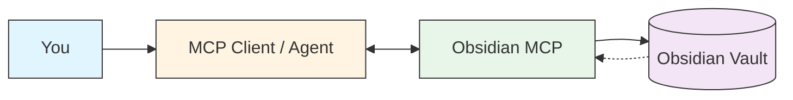
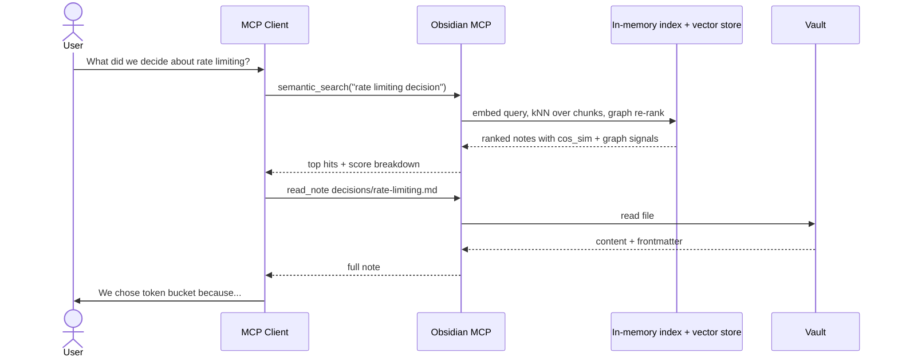

# Architecture

How Obsidian MCP fits between you, your agent, and your vault.

## Components

The server speaks stdio MCP — any MCP-capable client (Claude Code,
Cursor, Cline, Continue, Goose, Windsurf, etc.) can register it.

## Tool categories

```mermaid
flowchart TD
    MCP[Obsidian MCP - 34 tools]

    MCP --> FileOps[File Operations - 6 tools]
    MCP --> Search[Search - 4 tools]
    MCP --> Meta[Frontmatter - 2 tools]
    MCP --> Links[Links and Graph - 4 tools]
    MCP --> Tpl[Templates - 1 tool]
    MCP --> Lint[Lint - 4 tools]
    MCP --> Schema[Schema - 3 tools]
    MCP --> Ingest[Ingest - 3 tools]
    MCP --> Sem[Semantic - 3 tools]
    MCP --> Sug[Suggest - 3 tools]
    MCP --> Gnd[Groundedness - 1 tool]
    MCP --> Res[Resources - 2 auto-loaded]

    FileOps --> F1[read_note, write_note, append_note, list_notes, delete_note, move_note]
    Search --> S1[search, search_by_tags, search_by_frontmatter, search_by_date_range]
    Meta --> FM1[get_note_frontmatter, update_note_frontmatter]
    Links --> L1[get_backlinks, get_wikilinks, get_vault_graph, get_orphan_notes]
    Tpl --> T1[create_note_from_template]
    Lint --> LI1[find_broken_wikilinks, find_stale_notes, find_duplicate_titles, lint_vault]
    Schema --> SC1[get_schema, validate_note_schema, validate_vault_schema]
    Ingest --> IN1[list_inbox, find_related_notes, archive_inbox_note]
    Sem --> SM1[semantic_search, rebuild_embeddings, embedding_stats]
    Sug --> SG1[suggest_links, apply_link_suggestion, dismiss_link_suggestion]
    Res --> R1[vault-map, mocs]
```

See [`tools.md`](./tools.md) for the full per-tool reference.

## How an agent uses your vault

The index and vector store live under `<vault>/.obsidian-mcp/` and stay
in sync with the vault via the filesystem watcher — the agent never
needs to re-scan to see your latest edits.

See [`semantic.md`](./semantic.md) for the re-rank formula and
[`configuration.md`](./configuration.md#live-vault-sync) for the
watcher's conflict-detection behaviour on writes.
